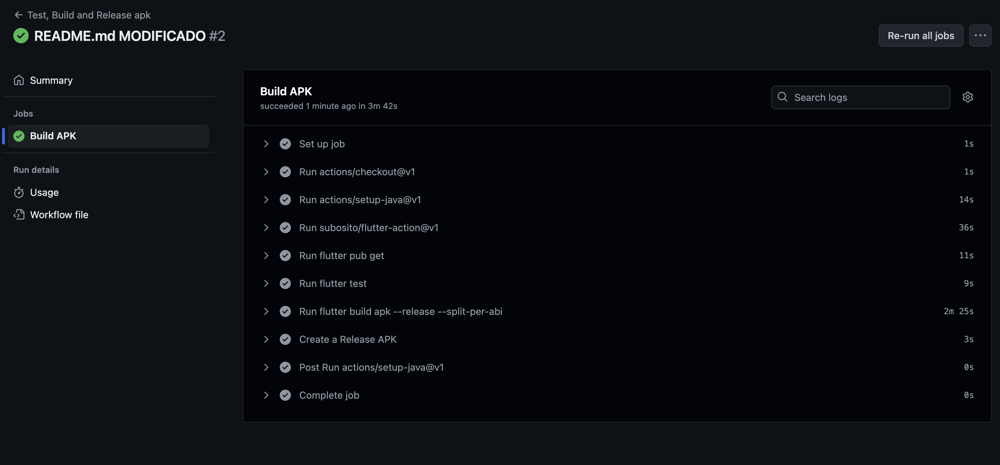
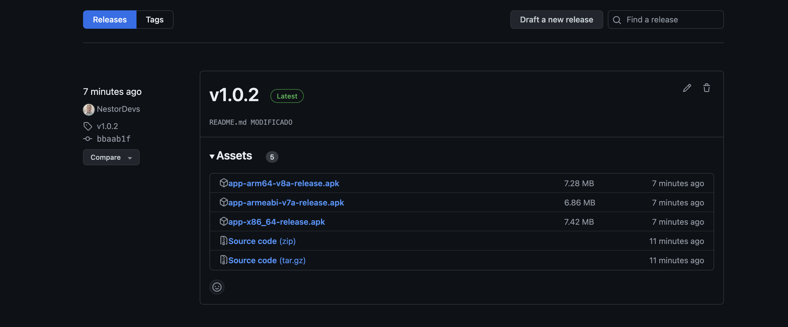

# Open Meteor

Prueba tecnica

# Stack para prueba
- Entorno: 
Flutter version 3.19.6
Dart version 3.3.3

# Paquetes utilizados
  - animate_do: ^3.3.4
  - cupertino_icons: ^1.0.6
  - flutter_launcher_icons: ^0.13.1
  - flutter_riverpod: ^2.5.1
  - go_router: ^14.1.1
  - google_fonts: ^6.2.1
  - http: ^1.2.1
  - intl: ^0.19.0
  - riverpod_annotation: ^2.3.5
  - rxdart: ^0.27.7
  - build_runner: 
  - mocktail: ^1.0.3
  - riverpod_generator: 

# Sobre la generacion de codigo
Utilize generacion de codigo para evitar problemas de sintaxys y un mejor rendimiento del trabajo

- Si desea replicar este proyecto en su maquina local asegurese de una vez instaladas todas las dependencias correr el siguente comando en la terminal

`dart run build_runner watch -d`

esto generara todos los archivos `**.g.dart`

# Arquitectura de la App
Utilize la arquitectura basada en caracteristicas (`Features`) propuesta en la siguiente imagen
</img>

Siendo este un enfoque bastante versatil para mantener el codigo escalable

# Estructura de carpetas siguinedo la Arquitectura 
</img>

# CI-CD para Open Meteor
- Integracion continua usando github actions: 
        - Se obtiene un release (`APK`) para pruebas en dispositivos fisicos
        - Incrementa el numero de releases con cada `PUSH` que enviemos a githbu en la rama `MAIN` 
            
</img>

# RELEASE ANDROID para Open Meteor
Fuente: https://github.com/NestorDevs/open-meteor-test/releases

## Captura
</img>